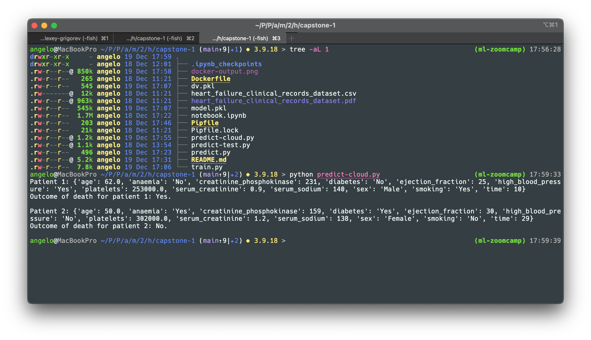

# ML Zoomcamp 2023 &ndash; First Capstone Project

The _Heart failure clinical records_ dataset contains the medical records of 299 patients who had heart failure. The datset was collected during their follow-up period, and contains 13 clinical features. These features, both numerical and categorcial, are patient age, presence or absence of anaemia, level of creatinine phosphokinase in the blood, presence or absence of diabetes, ejection fraction (percentage of blood leaving 
the heart at each contraction), presence or absence of high blood pressure, platelet level in the blood, level of serum creatinine in the blood, level of serum sodium in the blood, patient sex, presence or absence of patient smoking, follow-up check-up time, and death event. This is a classification problem, with the death event column as the binary outcome column.

The research article based on the data set states that a random forest model is the best model that can predict survival of patients with heart failure from the serum creatinine and ejection fraction features alone. This can be readily seen in the feature importance plot, as the features of greatest importance after follow-up check-up time are indeed serum creatinine and ejection fraction. Moreover, one can also make a similar oberservation in both exploratory data analysis box plots of death event versus serum creatinine and ejection fraction. Although interesting in itself, further analyses from the exploratory data analysis observations are still warranted to obtain a complete picture of the data set.

The research article can be accessed at the link, [Machine learning can predict survival of patients with heart failure from serum creatinine and ejection fraction alone](https://www.semanticscholar.org/paper/Machine-learning-can-predict-survival-of-patients-Chicco-Jurman/e64579d8593140396b518682bb3a47ba246684eb) (link to pdf [here](https://bmcmedinformdecismak.biomedcentral.com/counter/pdf/10.1186/s12911-020-1023-5.pdf)).

The data set can be retrieved from the UCI Machine Learning Repository at the link, [Heart failure clinical records](http://archive.ics.uci.edu/dataset/519/heart+failure+clinical+records).

The data analysis is organized in the following files as follows:

1. `notebook.ipynb` contains:
    * Data preparation and data clearning,
        * Pair plot of numerical features,
        * Box plots of death event versus age, creatinine phosphokinase, ejection fraction, platelets, serum creatinine and serum sodium aggregated on sex, diabetes, smoking and high blood pressure,
        * Bar plots of counts of death events, anaemia, diabetes, high blood pressure, sex and smoking.
    * Model selection process with Logistic Regression, Decision Trees, Random Forests and eXtreme Gradient Boosting (XGBoost),
    * Hyper-parameter tuning on Random Forests model using `GridSearchCV`,
    * Feature importance analysis plot with default hyperparameters values of the Random Forests model.

2. `train.py`
    * Training the final model with the default hyperparameters values for the Random Forests model, taken from the Jupyter notebook file,
    * Saving the model and `DictVectorizer` class instance to pickle files,
    * Best F1 and AUC values with default Random Forest hyperparameters, at 0.769 and 0.834 respectively.
        * Due to the small dataset, the default Random Forest hyperparameters give the best F1 and AUC values, and hyperparameter fine tuning doesn't improve these values.

3. `predict.py`
    * Loading the model and `DictVectorizer` object from the `model.pkl` and `dv.pkl` files respectively,
    * Serving it via Flask web service.
    * The dependency files in the GitHub repository used for the model are:
        * `Pipfile`,
        * `Pipfile.lock`,
        * `Dockerfile`. 
    * Commands to create and run Docker container locally:
        * `docker run -it --rm --entrypoint=bash python:3.9.18-slim`
        * `docker build -t capstone-project-1 .`
        * `docker run -it --rm --entrypoint=bash capstone-project-1`
    * `Dockerfile` contains the necessary Python packages to create the Docker container. The specific packages are:
        * `pandas`,
        * `gunicorn`,
        * `flask`,
        * `numpy`,
        * `scikit-learn` version 1.2.2,
        * `python` version 3.9.18.

4. `predict-test.py`
    * Testing the model locally on the Docker container with Python 3.9.18 and Scikit-Learn 1.2.2, using two patient records, one with an adverse death outcome and one without. Requires docker running in the background. The Docker command is: `docker run -it --rm -p 9696:9696 capstone-project-1`.

5. `predict-cloud.py`
    * Testing the same model as above, remotely hosted on [Render](https://render.com/ "https://render.com/") on the Docker container with the same configuration, using the same two patient records, one with an adverse death outcome and one without.
    * Commands to push Docker container remotely:
        * Login in with your Docker credentials from the terminal command line: `docker login`
        * Run `docker image tag capstone-project-1:v1 capac/projects:capstone-project-1`.
        * Run `docker image push capac/projects:capstone-project-1`.
    * Running the file locally with `python predict-cloud.py` will trigger the model and produce a result. You may need to wait for several seconds for the outcome to appear in the terminal, since Render may need to spin up the container if it's inactive.
    * The image below gives an idea of the output for the remote Docker container with the model:

