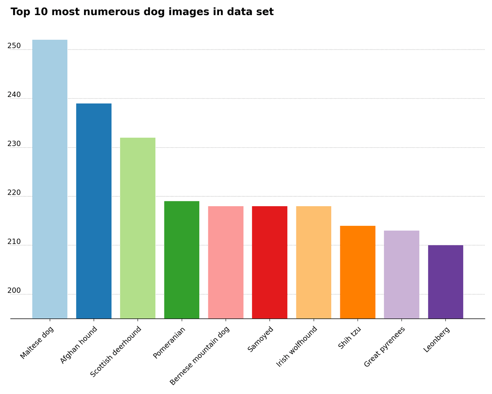

# ML Zoomcamp 2023 – Second Capstone Project

## Summary

This computer vision project aims to build a convolutional neural network (CNN) using transfer learning for classification of 10 different dog breeds. The original dataset can be retrieved from the [ImageNet Dogs Dataset for Fine-grained Visual Categorization](http://vision.stanford.edu/aditya86/ImageNetDogs "http://vision.stanford.edu/aditya86/ImageNetDogs") from the [Stanford Vision and Learning Lab (SVL)](https://svl.stanford.edu/ "https://svl.stanford.edu/").

As mentioned on the website, the Stanford Dogs dataset contains images of 120 breeds of dogs from around the world. This dataset has been built using images and annotation from ImageNet for the task of fine-grained image categorization. The dataset can also be found on Kaggle at [Stanford Dogs Dataset](https://www.kaggle.com/datasets/jessicali9530/stanford-dogs-dataset/ "https://www.kaggle.com/datasets/jessicali9530/stanford-dogs-dataset/").

### Project files

* `make_dataset.py`
    * Downloads and extracts the Stanford Dogs dataset images and annotations.
* `data_selection.py`
    * Crops dog images for all 120 dog breeds. Use only if you want the complete data set for modeling.
* `exploratory_data_analysis.py`
    * Shows bar plot of the top 10 folders by number of unique dog breed images. The bar plot itself is in the `plots` folder.
* `notebook.ipynb`
    * Crops dog images, and runs model training with hyperparameter fine-tuning, with plots of accuracy for the validation data, and saves the model with the best hyperparameters. **IMPORTANT: run notebook only after running the `make_dataset.py` script.**
* `training.py`
    * It is a standalone file that achieves the same result as the notebook without validation accuracy plots, and saves the model with best hyperparameters as an HDF5 file. The HDF5 model file is named `xception_v1_48_0.968.h5`.
* `convert_model.py`
    * Converts `xception_v1_48_0.968.h5` HDF5 file to a TFLite file named `top_10_dog_breeds.tflite`.
* `Dockerfile`
    * File with the commands and package requirements to build a local Docker image.
* `lambda_function.py`
    * Contains lambda helper function for Docker container.
* `test.py`
    * Run model on test image file in local Docker container.
* `test_cloud.py`
    * Run model on test image file in remote Docker container.
* `requirements.txt`
    * List of required packages to set up a local, working Python environment.

## Data preparation

First thing to do, before running `notebook.ipynb`, is to run `make_dataset.py` to download the complete [Stanford Dogs dataset](http://vision.stanford.edu/aditya86/ImageNetDogs "http://vision.stanford.edu/aditya86/ImageNetDogs") and extract the images and annotations in the `data/raw/Image` and `data/raw/Annotation` subdirectories. The complete dataset contains 120 different dog breeds and will require a lot of compute resources and time. I decided to concentrate only on the top 10 folder with the highest number of dog images, which are the Afghan hound, Bernese mountain dog, Great pyrenees, Irish wolfhound, Leonberg, Maltese dog, Pomeranian, Samoyed, Scottish deerhound and Shih tzu.

The Jupyter notebook selects and crops these dog breed image folders for you. The number of unique images in the top 10 folders is shown in the exploratory data analysis bar plot, which you can generate by running `exploratory_data_analysis.py`, the bar plot itself is shown below.

## Data generation

Once `make_dataset.py` has finished downloading and extracting the images and annotations, you may either run the `notebook.ipynb` Jupyter notebook, or run the `training.py` file. Both files accomplish the same goal: the images from the 10 most numerous subfolders of dog images are selected and cropped to 299 x 299 pixels to solely contain the image of the dog. Each dog breed folder is renamed by removing the alphanumeric prefix, which helps create a `tf.data.Dataset` object from image files in each directory. I've also checked for data corruption in the images, and removed those if they had 'JFIF' in the header. There were none found in the dataset.

## Model training

The model is generated from a pre-trained convolution neural network from ImageNet using transfer learning, and is accessed from the `tensorflow.keras.applications.xception.Xception` class in TensorFlow. I used the `keras.utils.image_dataset_from_directory` class in Keras to generate a training, validation and testing dataset split. 70% of the image dataset is used as the training set, while the remaining 30% is equally split between validation and testing datasets. Data augmentation was carried out on the data set, by horizontally flipping the images and by randomly adding a 10 degree rotation to the images. The dense, upper layers are built using the training dataset. Model hyperparameter fine-tuning was accomplished using different values for the learning rate, different sizes of an additional internal layer, and different dropout rates. The best values are saved and used to generate the final model, saved as `xception_v1_48_0.968.h5`, and is tested on the test set to achieve an accuracy of 92.19%. The model file has then been converted into a TFLite file named `top_10_dog_breeds.tflite`, which is used in the Docker image created successively.

IMPORTANT: the HDF5 and TLFite model files haven't been saved on GitHub due to the 100 MB large file constraint.

## Containerization

The `Dockerfile` provided in the repository permits to build locally a Docker image using an AWS ECR Lambda instance (`public.ecr.aws/lambda/python:3.10`) in Python 3.10. The image will also contain [TF-Lite for AWS Lambda from Alexey Grigorev's repository](https://github.com/alexeygrigorev/tflite-aws-lambda "https://github.com/alexeygrigorev/tflite-aws-lambda"). In the build process, `lambda_function.py` and the TFLite model (`top_10_dog_breeds.tflite`) will be copied over to the image. Once the Docker app is running on your computer, to build and run the Docker image you need to launch the following two commands from the terminal command line:

 * `docker build -t capstone-project-2:v1 .`,
 * `docker run -it --rm -p 8080:8080 capstone-project-2`.

Using the `test.py` Python script from another terminal, you can get a prediction from the model using an [online image of a Great Pyrenees dog](https://images.unsplash.com/photo-1636496430627-a7b203b4cc58).

## Cloud deployment

The Docker image is remotely hosted on [AWS](https://aws.amazon.com/ "https://aws.amazon.com/"). You need to install the [AWS command line tools](https://aws.amazon.com/cli/ "https://aws.amazon.com/cli/") in the terminal, and configure the tool the first time you use it. To deploy the Docker image remotely, run the following commands:

 * `aws ecr get-login-password | docker login --username AWS --password-stdin $REMOTE_URI`
 * `docker tag capstone-project-2:v1 $REMOTE_URI`
 * `docker push $REMOTE_URI`

The `$REMOTE_URI` is a variable that contains the full link to the Docker resource on AWS. Running the file locally with `python test_cloud.py` will trigger the model on the remote Docker image and produce an output in the terminal. You may need to wait for several seconds for the outcome to appear.

The image from the terminal below gives an idea of the output for the remote Docker container with the model, using an image of a [Great Pyrenees dog](https://images.unsplash.com/photo-1636496430627-a7b203b4cc58), which is the same image referred to in the link above:

